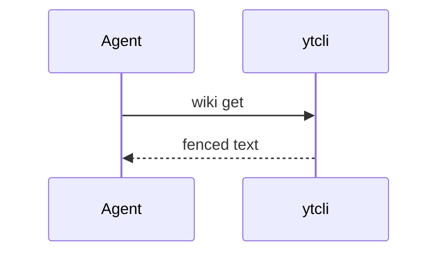

# A Wiki page that uses every piece of markup

The source of a showcase page built with `ytcli wiki create` and checked in a
browser on a real Yandex Wiki, construct by construct. Everything here
rendered. Copy a construct from it rather than guessing: the Wiki's own
documentation describes several of these without showing them, and the
guesses that failed (footnotes, `[TOC]`, a bare `[] item`) are listed in
`wiki.md`.

The page is Markdown with the Wiki's extensions. The visual editor rewrites
what it saves — it escapes syntax it does not know and reformats tables — so
this is the form to write, not necessarily the form read back after somebody
edits the page in a browser.

````markdown
# Showcase {#top}



## Text styles

**Bold**, _italic_, ++underline++, ~~strikethrough~~, ##monospace##,
`inline code`, ==highlight==, E=mc^2^, H~2~O.

{red}(Red), {green}(green), {blue}(blue), {gray}(gray), {yellow}(yellow),
{orange}(orange), {violet}(violet).

Emoji :smile: :rocket: and a mention @login.

---

## Lists

1. First
2. Second
   1. Nested numbered
3. Third

- Bullet
  - Nested bullet

[ ] An open checklist item

[X] A done checklist item

- [ ] An open task-list item
- [x] A done task-list item

## Quote

> A quote.
>
> > A quote inside it.

## Links and anchors

[External link](https://yandex.ru), [a Wiki page](/users/login),
[an anchor on this page](#top), a bare address: https://tracker.yandex.ru

An inline anchor with a hint: #[here](here "What the anchor marks")

## Tracker

An issue key on its own becomes a live card: QUEUE-1

So does an issue's address: https://tracker.yandex.ru/QUEUE-2

A queue's issues, 50 at most (a filter's address works too):



## Code

```bash
ytcli wiki get users/login/showcase
```

## Formulas

Inline: $E = mc^2$

$$
\sum_{i=1}^{n} i = \frac{n(n+1)}{2}
$$

## Tables

| Markdown | table |
|---|---|
| **bold** cell | `code` cell |

#|
|| Multiline | table ||
||

- a list
- in a cell

|

```
code in a cell
```

||
|#

## Blocks



A note: info, tip, warning and alert are the types.





Hidden until opened.





- First tab

  Content of the first tab.

- Second tab

  Content of the second tab.



## Diagrams





@startuml
ytcli -> Wiki : GET /v1/pages
@enduml



A draw.io diagram is drawn in the editor and saved with its picture inline;
`wiki get` shows the payload as its size unless `--full`:



## Embedded content

/iframe/(src="https://yandex.ru/map-widget/v1/?ll=37.588144%2C55.733842&z=16" width="600" height="300" frameborder="0" scrolling="no")

/iframe/(src="https://www.youtube.com/embed/oCRQj_zyPjk" width="560" height="315" frameborder="0" scrolling="no")


The file attached to this page: [notes.txt](/users/login/showcase/.files/notes.txt)

## Dynamic table


````

A grid made with `wiki create-grid` is only a resource of the page until a
`wgrid` line puts it in the text. The one on the showcase page had a column of
every type — text, number, date, checkbox, list, person, Tracker issue and
issue status — filled with `wiki columns-add` and `wiki rows-add`; the issue
status column fills itself from Tracker. A wide grid scrolls sideways in the
browser rather than wrapping.
